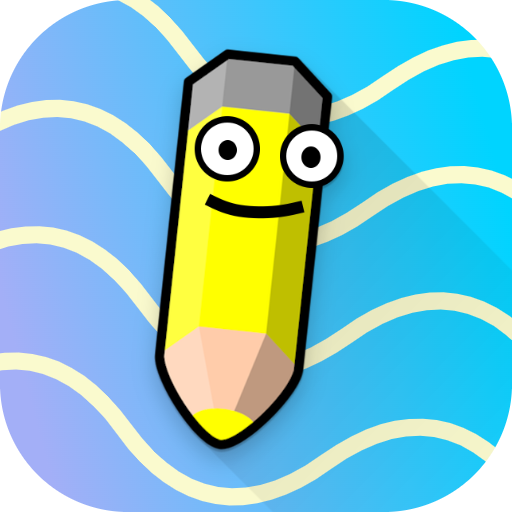

  <h1>Finish the Drawing!</h1>

  <h3>✏️ Daily competitions to finish the drawing</h3>

# Overview

Every day we generate a random scribble and a new word. Your goal is to use your imagination to use that scribble to create a drawing of that word. You can view and rank other users submissions, and the top three drawings of the day will win.

# Services

| Service  | Tool                                                                                                           | Doc | Image |
| -------- | -------------------------------------------------------------------------------------------------------------- | --- | ----- |
| api      | , GORM, Gin    | -   | -     |
| frontend |  | -   | -     |

# CICD

GitHub Workflows will handle the building and pushing of the containers when the relevant service has been modified. Our pods will pull the latest one on restart.
